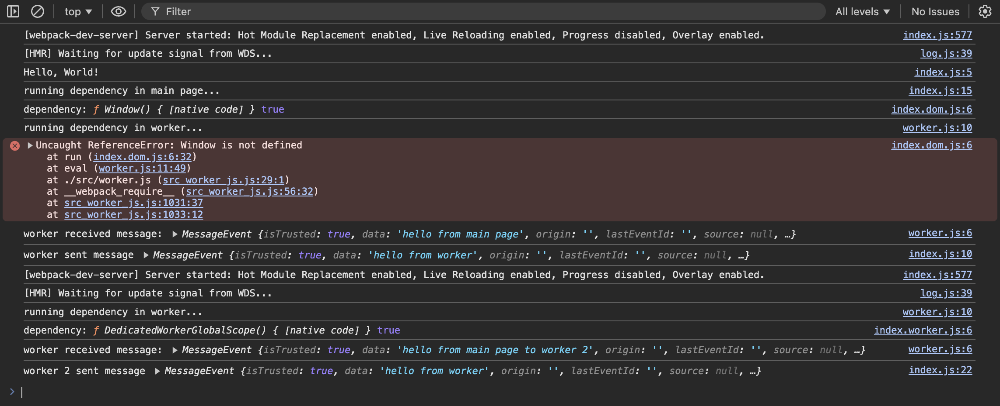

# webpack web worker issue repro

This demonstrates an issue where webpack does not use the [`worker` export condition](https://webpack.js.org/guides/package-exports/#target-environment) when using `new Worker(new URL('./worker.js', import.meta.url))` to [automatically create a web worker bundle](https://webpack.js.org/guides/web-workers/#syntax).

## Steps to Reproduce

1. Download/Clone repository
2. `npm install`
3. `npm run dev`
4. Open `http://localhost:8080`
5. Open Console

Output should look like this:

```log
index.js:577 [webpack-dev-server] Server started: Hot Module Replacement enabled, Live Reloading enabled, Progress disabled, Overlay enabled.
log.js:39 [HMR] Waiting for update signal from WDS...
index.js:5 Hello, World!
index.js:15 running dependency in main page...
index.dom.js:6 dependency: ƒ Window() { [native code] } true
worker.js:10 running dependency in worker...
index.dom.js:6 Uncaught ReferenceError: Window is not defined
    at run (index.dom.js:6:32)
    at eval (worker.js:11:49)
    at ./src/worker.js (src_worker_js.js:29:1)
    at __webpack_require__ (src_worker_js.js:56:32)
    at src_worker_js.js:1031:37
    at src_worker_js.js:1033:12
run @ index.dom.js:6
eval @ worker.js:11
./src/worker.js @ src_worker_js.js:29
__webpack_require__ @ src_worker_js.js:56
(anonymous) @ src_worker_js.js:1031
(anonymous) @ src_worker_js.js:1033
worker.js:6 worker received message: MessageEvent {isTrusted: true, data: 'hello from main page', origin: '', lastEventId: '', source: null, …}
index.js:10 worker sent message MessageEvent {isTrusted: true, data: 'hello from worker', origin: '', lastEventId: '', source: null, …}
```


